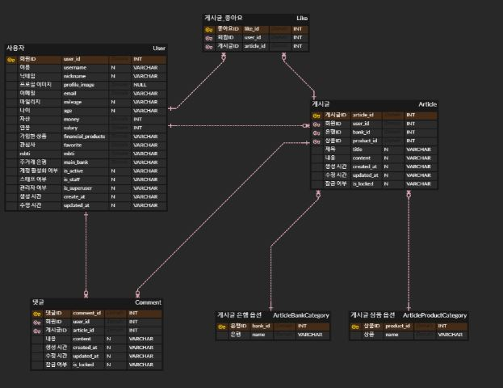
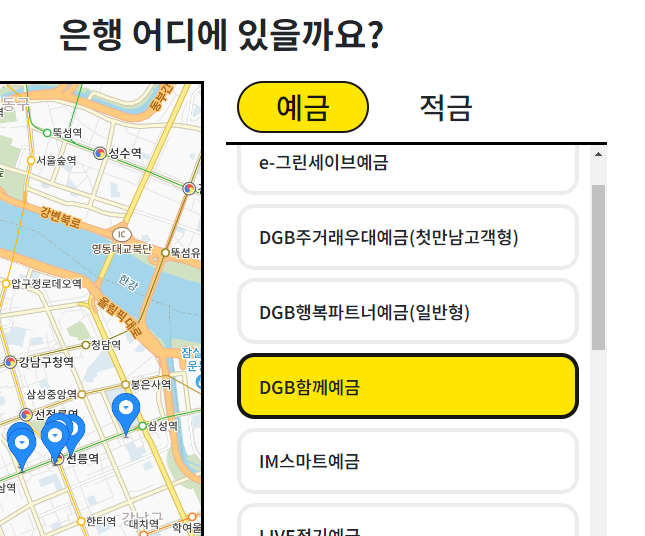

# FINAL PJT 

### 이번 pjt 를 통해 배운 내용
* 1학기 프레임워크 활용 정리
* 서비스 기획 방식
* git 협업

## A. 팀원 정보 및 업무 분담 내역

1. 서비스 개요 설정
  * 서비스 이름 : BBB(BuzzBucksBuddy)
  * 서비스 분류 : 금융 비교 웹사이트
  * 서비스 이용자 : 2040세대
  * 컨셉 목적 : 친근하고 손이 자주 가는 금융
  
  "BuzzBucksBuddy"는 활기찬(buzzy) 분위기와 돈(bucks)을 친구(buddy)처럼 적극적으로 돕는 이미지를 전달합니다. 따라서 이 이름은 예금과 적금을 유쾌하고 즐거운 분위기로 비교하는 서비스를 나타냅니다.

2. 업무 분담
  * 랜덤 사다리를 통한 기능별 업무 분담
  - 김준수
      - 원하는 지역과 은행을 지정하여, 가까운 곳에 위치한 은행을 찾는 기능
      - 상품 추천 페이지
      - 게시판
  
  - 류지수
      - 화폐 별 환율 계산과, 해당 환율에 대한 이슈를 함께 보여 주는 기능
      - 유저 관리 기능
      - 마이페이지
      - 마일리지 코인 버튼 구현
  
  - 손지은
      - 예금 / 적금 데이터 분류
      - 사용자가 선택한 은행, 저축 기간, 저축 유형 별로 예금/적금 상품들을 조회하여 옵션 선택해 가입할 수 있도록 하는 기능
  

3. 프로젝트 관리
  - 노션
  - git
  - Figma
  - ERD

## B. 설계 내용(아키텍처 등) 및 실제 구현 정도

1. 설계 내용
  - 로그인, 회원 가입
  - 프로필 페이지(상품 장바구니)
  - 홈
  - 예적금 비교 페이지
  - 환율 계산기 페이지
  - 은행 지도 검색 페이지
  - 게시판

2. 활용 프레임워크
  - Django
  - Vue

3. 화면 구성
  - components 별 Figma 목업페이지 활용

4. 기본 명세서 구현 완료 + 추가 기능 구현

## C. 데이터베이스 모델링(ERD)
1. ERD
  
  - 모델 작업 추가

## D. 금융 상품 추천 알고리즘에 대한 기술적 설명
 1. 회원 정보 활용 (관심사, 나이, 자산, 연봉, MBTI)
  - 회원과 비슷한 특성을 가진 다른 회원 탐색
  - 그들이 가입한 상품 탐색 
  - 가입 순위 순으로 추천

## E. 서비스 대표 기능들에 대한 설명
 1. 홈 페이지
   
    - 서비스 컨셉을 가진 로고와 메인 페이지 구현
    - 랜덤 추천 상품을 캐러셀로 홍보
    - 랜덤 포인트 쌓기 기능 (이후 마일리지 활용 가능)
    - MBTI 별 예/적금 상품 가입 랭킹
 

 2. 상품 추천 페이지
    
    - 관심사, 나이, 자산, 연봉을 기준으로 추천
    - 해당 상품 가입 시 예측 이자 계산
    - 이자로 구매 가능한 관심사 제품 제공 -> 자산관리 동기 부여

  3. 프로필 페이지
    
     - 회원 정보 등록
     - 가입 상품 정보
     - 가입 상품 금리 그래프 비교
  

  4. 예적금 비교 페이지
    
      - 금융감독원 예적금 API 활용 + 데이터 저장
      - 예적금 상품 목록 출력
      - 예적금 상품 옵션에 따른 분류
      - 상세페이지: 상품 및 옵션 정보 출력, 가입하기
  

  5. 환율 페이지
    
      - 한국수출입은행 현재 환율 API 활용
      - 환율 계산기: 환율 유형 및 국가 카테고리에 따른 환율 계산
      - 관련 뉴스: 해당 화폐 관련 뉴스 크롤링
  

  6. 지도에서 은행 검색
     
      - 카카오 지도 API 활용
      - 지역 범위와 특정 은행을 선택하여 검색
      - 은행 위치와 해당 은행이 가진 예적금 상품 출력 (상세 페이지 이동)
  

  7. 게시판
    - 게시글 목록
      - 게시글 작성 (+ 잠금 기능)
      - 카테고리 선택하여 게시글 분류
      - 카테고리와 키워드 검색으로 게시글 서치
    - 게시글 상세
      - 좋아요 버튼
      - 게시글 수정/삭제
      - 댓글 작성/수정/삭제 (+ 잠금 기능)
  

  8. 마일리지
    - 전체 페이지에 위치/시간 랜덤 버튼 생성 (DB에 저장)

## F. 후기
  * 프론트와 벡엔드를 연결하면서 전체적인 흐름을 다시 한 번 더 이해할 수 있었습니다.
  * 큰 데이터에서 필요한 부분을 추출하고 정렬하면서 사용하는 것을 익힐 수 있었습니다.
  * 여러 기능을 구현하기 위해 공부하고 찾아보다보니 많이 배운 것 같습니다.